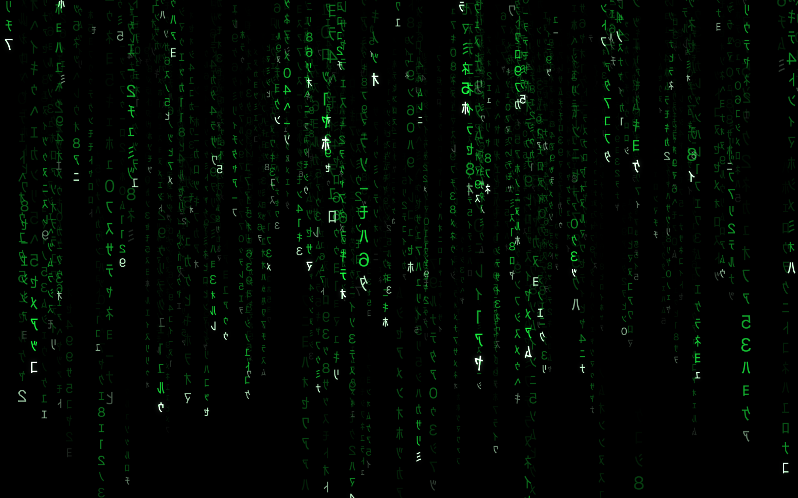

# Modern Matrix

The 3D "digital rain" from the title sequence of *The Matrix* — a native screensaver for
**macOS** (Apple Silicon · Swift + Metal) and **Windows** (Direct3D 11), built from scratch
from one shared C engine.



It's a from-scratch recreation of XScreenSaver's **GLMatrix** — still the best-looking 3D
Matrix saver, but one that only exists as an x86-64 binary. Under Rosetta inside Apple's
screensaver host on a multi-display Apple-Silicon Mac, that original produces the "boxed
across two screens" rendering, runaway memory, and general flakiness. Modern Matrix is fully
native on both platforms, leak-free, and adds bloom, HDR, high-refresh rendering, and crisp
runtime-generated glyphs.

## Download & install

### 🍎 macOS — Apple Silicon, macOS 26+

**⬇ [Download ModernMatrix-macOS.zip](https://github.com/DigitalChewie/ModernMatrixScreensaver/releases/latest/download/ModernMatrix-macOS.zip)**

1. Unzip it.
2. Double-click **Modern Matrix.saver** → System Settings opens → click **Install**.
3. *(Optional)* drag **Modern Matrix.app** into your Applications folder — the live settings editor.

Signed with a Developer ID and **notarized by Apple**, so it opens with no security warning.

### 🪟 Windows — 10/11, 64-bit

**⬇ [Download ModernMatrix.scr](https://github.com/DigitalChewie/ModernMatrixScreensaver/releases/latest/download/ModernMatrix.scr)**

1. Right-click **ModernMatrix.scr** → **Install** *(or copy it into `C:\Windows\System32` and pick
   "ModernMatrix" in Screen Saver settings)*.
2. Click **Settings…** for the live preview and all the options below.

Single self-contained file (~245 KB), no dependencies.

## Features

All of the original GLMatrix controls, plus modern additions:

| Control | Notes |
| --- | --- |
| Glyph density | 60–900 falling columns |
| Glyph speed | fall rate + glyph mutation rate |
| Matrix encoding | Matrix · Binary · Hexadecimal · Decimal · DNA · Unicode katakana |
| Fog | depth-based fade |
| Waves | travelling brightness wave along the columns |
| Panning | slow camera drift between framed views |
| Textured / Wireframe | glyph texture vs. cell outlines |
| **Bloom glow** | HDR bright-pass + separable Gaussian glow |
| **HDR highlights** | leaders pop on capable displays (EDR on macOS, scRGB on Windows) |

Glyphs are generated at runtime (Core Text on macOS, DirectWrite on Windows), mirrored like
the film, so they stay crisp at any resolution.

**Configuring** — macOS: use **Modern Matrix.app** (a live preview beside the settings), or
System Settings ▸ Screen Saver ▸ **Options…**. Windows: **Settings…** in Screen Saver settings.

## Limitations (macOS)

A platform quirk, not a bug — and confirmed by Apple's own engineers:

- **The little catalogue thumbnail in System Settings is a generic placeholder, not the rain.**
  macOS 26 removed custom thumbnails for third-party `.saver` plug-ins
  ([Apple DTS · forums thread 806641](https://developer.apple.com/forums/thread/806641)). The
  **live preview**, the **companion app**, and the **actual running screensaver** all show the
  real rain — only that one tiny grid icon is the placeholder.

## Requirements

- **macOS:** Apple Silicon Mac, macOS 26+
- **Windows:** 64-bit Windows 10 / 11

*(Building from source needs the Xcode 26 toolchain on macOS, or Visual Studio Build Tools 2022
with the "Desktop development with C++" workload on Windows.)*

---

## Building from source

One shared engine — `core/mmcore.c`, portable C99 holding the simulation, settings, and glyph
encodings — wrapped in a thin platform layer per OS. No `.xcodeproj`, no IDE project files: a
tweak to the rain's behaviour in `mmcore.c` updates both platforms at once.

### macOS (Swift + Metal)

```sh
./build.sh            # build harness + saver (debug)
./build.sh install    # release-build + install BOTH the saver and the app
./build.sh dist       # Developer ID sign + notarize + staple + zip for distribution
./build.sh snapshot   # render one frame to build/snapshot.png
./build.sh clean
```

Offscreen preview (try settings without a display):

```sh
BIN="build/Modern Matrix.app/Contents/MacOS/MatrixRainHarness"
"$BIN" --snapshot out.png --encoding 5 --density 0.85 --panning --warmup 140
# flags: --encoding 0..5  --density 0..1  --speed 0..1  --wireframe
#        --no-bloom --no-fog --no-textured --no-waves --panning --warmup N
```

### Windows (Direct3D 11)

See **[`windows/README.md`](windows/README.md)**. `windows\build.ps1` (VS Build Tools 2022)
compiles `core/mmcore.c` + the D3D11 renderer + DirectWrite atlas into a single `ModernMatrix.scr`.

### Layout

```
core/              shared C engine (mmcore) — sim, settings + derived, encodings, constants
Sources/Core/      macOS Swift/Metal layer over the engine
Sources/Saver/     macOS ScreenSaverView subclass + configure-sheet
Sources/Harness/   macOS companion app — live preview + settings, --snapshot mode
Resources/Shaders.metal
windows/           Windows .scr — D3D11 renderer, DirectWrite atlas, config dialog (links mmcore)
build.sh           compiles mmcore (clang) + Swift (swiftc) + Metal, assembles & signs the bundles
PORTING.md         the cross-platform blueprint (how the Windows port was built)
```

### How the macOS screensaver host is driven

Rendering is driven by the host timer (`animateOneFrame`) as a baseline, with a view-bound
`CADisplayLink` as a smoothness optimisation gated by a watchdog — the host's display link
frequently never fires on macOS 26, so the timer guarantees frames. All state is per-instance
(no globals that leak across the host's repeated instantiations), and density auto-lowers for
the small System Settings preview.
